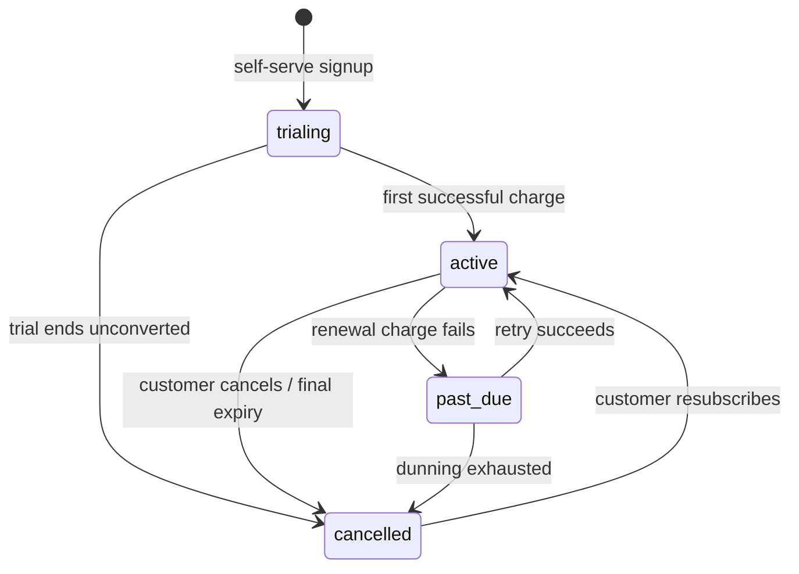

# Subscription State Machine

Canonical internal entitlement states for Menu Master NG. Written before
migration `0017` so that the constraint encodes an agreed model rather than
whatever the code happened to do.

**Four states, and only four:**

```
trialing    the account has never paid; access granted for the trial window
active      paid, and expected to renew
past_due    paid previously; a renewal charge has failed; in dunning
cancelled   will not renew
```

These are **ours**. Paystack's vocabulary is larger and changes at Paystack's
discretion; its statuses are *mapped* at the boundary, never persisted.

---

## 1. Why entitlement is not the same as status

`cancelled` does not mean "access revoked". A customer who cancels on day 3 of a
paid month keeps what they paid for. Encoding that as an early `cancelled`
would rob them; encoding it as `active` would lose the fact that they cancelled.

Rather than add a fifth state or a `cancel_at_period_end` flag, entitlement is
**derived from status and date together**:

```
entitled  ==  status IN ('trialing','active','past_due')
          OR  (status = 'cancelled' AND current_period_end > now())
```

`past_due` is deliberately inside the entitled set. Dunning is a grace period —
a failed card should not lock an owner out of her own costing data the same
afternoon. Whether that grace has an outer bound is a commercial decision, not a
database one.

This also survives the absence of a scheduler. Nothing in Menu Master NG runs on
a timer today, so a row can legitimately sit at `active` with a
`current_period_end` in the past. A date-aware entitlement rule gives the right
answer anyway; a status-only rule would not.

**As of `0016`, nothing in the codebase reads `subscriptions.status` at all.**
The only reader is `fn_guard_subscription_writes`, which compares against
`'trialing'` when validating a self-serve signup. Until an entitlement helper
exists, this document plus the `0017` CHECK constraint *are* the state machine.

## 2. Legal transitions



Not legal: anything into `trialing`. A trial is once per account, and
`fn_guard_subscription_writes` already refuses a second subscription row.

`0017` does **not** enforce this matrix — it constrains the *set* of values, not
the transitions between them. Enforcing transitions belongs with the webhook
that will actually drive them, and is recorded as a follow-on rather than
smuggled into a migration whose approved scope is three specific protections.

## 3. The five scenarios

### 3.1 A trial converts successfully

Paystack `charge.success` for the first invoice.

| | |
|---|---|
| Transition | `trialing → active` |
| `current_period_end` | set from Paystack's next payment date |
| `trial_ends_at` | **left as-is** — it is a historical fact, not live state |
| `provider_ref` | set to the Paystack subscription code |

### 3.2 Payment or renewal fails

Paystack `invoice.payment_failed`.

| | |
|---|---|
| Transition | `active → past_due` |
| `current_period_end` | **not advanced** — nothing was paid for |
| Entitlement | retained (grace) |

A later successful retry returns it to `active` and advances the period end. If
Paystack exhausts its retries (`subscription.disable`), it becomes `cancelled`.

### 3.3 A customer cancels with paid access remaining

Paystack `subscription.not_renew` / status `non-renewing`.

| | |
|---|---|
| Transition | `active → cancelled` **immediately** |
| `current_period_end` | **untouched** — this is what preserves their access |
| Entitlement | retained until `current_period_end` passes, by the §1 rule |

This is the case that justifies deriving entitlement rather than reading status.
`cancelled` here means *will not renew*, and says nothing about today.

### 3.4 Paid access reaches its expiry date

No event necessarily arrives — expiry is the *absence* of a renewal.

| | |
|---|---|
| Transition | none required |
| Entitlement | lapses automatically, because `current_period_end <= now()` |

A subsequent `subscription.disable` moves the row to `cancelled` for tidiness.
Correctness does not depend on that arriving, which is the point.

### 3.5 Paystack sends an unknown or unexpected status

**Fail safe, loudly, and change nothing.**

1. `fn_set_subscription_plan` rejects any status outside the four, with a
   distinct error code (`22023`, invalid parameter value).
2. The subscription row is left **exactly as it was**. A partial or guessed
   write is worse than no write.
3. The exception propagates, so the webhook handler returns non-2xx, Paystack
   marks the delivery failed and retries, and the failure is visible in
   Paystack's own dashboard rather than silently absorbed.
4. The `CHECK` constraint is the backstop: even a direct `service_role` write
   cannot persist an unrecognised value.

The safe failure is **refusing to record**, not defaulting to `cancelled`
(which would cut off a paying customer) or to `active` (which would give away
the product). Neither guess is acceptable, so we do not guess.

A `billing_events` audit table would be better than relying on Paystack's
delivery log, and is recorded as a follow-on. It is out of `0017`'s scope.

## 4. Follow-on items, deliberately not in 0017

| Item | Why deferred |
|---|---|
| `fn_account_is_entitled(account_id)` implementing §1 | No caller exists yet; nothing reads status today |
| Transition-matrix enforcement | Belongs with the webhook that drives it |
| `billing_events` audit table | New table, beyond the three approved protections |
| Plan-limit enforcement from `plan_features` | Phase 2 |
